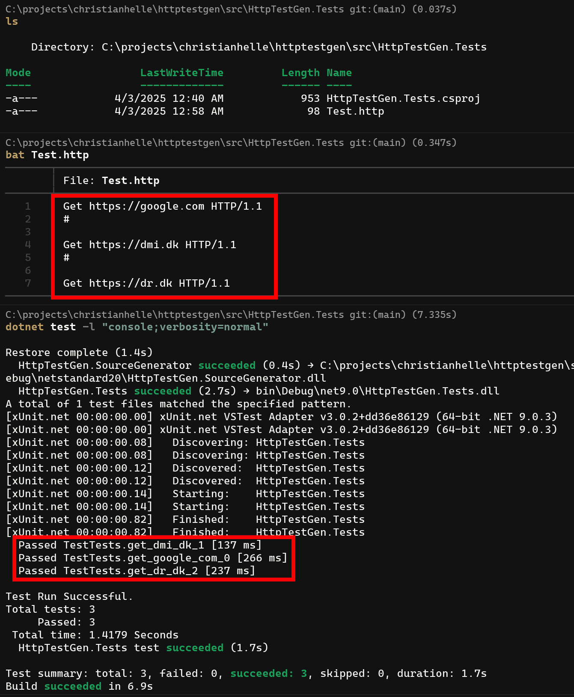
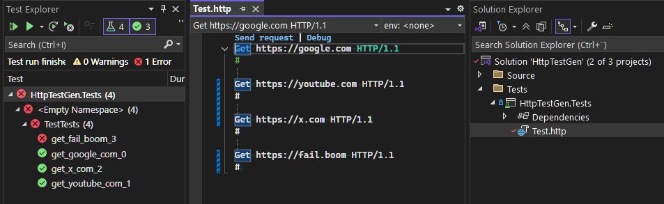

# HttpTestGen - .http File Testing Framework

A powerful .NET source generator that automatically converts `.http` files into fully functional C# test code. This tool bridges the gap between API testing in IDEs (like Visual Studio Code with the REST Client extension) and automated testing in your .NET projects.

## 🚀 Features

- **Automatic Test Generation**: Transform `.http` files into xUnit or TUnit test code at compile time
- **Rich HTTP Support**: Parse GET, POST, PUT, DELETE, PATCH, HEAD, OPTIONS, and TRACE methods
- **Header Processing**: Full support for HTTP headers including custom headers
- **Request Bodies**: Support for JSON, XML, and text request bodies
- **Response Assertions**: Validate expected status codes and response headers
- **Multiple Test Frameworks**: Generate tests for xUnit and TUnit
- **Source Generator**: Zero-runtime overhead with compile-time code generation
- **IDE Integration**: Works seamlessly with existing `.http` files in your IDE

## 📦 Installation

### xUnit Generator

```xml
<PackageReference Include="HttpTestGen.XunitGenerator" Version="1.0.0">
  <PrivateAssets>all</PrivateAssets>
  <IncludeAssets>runtime; build; native; contentfiles; analyzers</IncludeAssets>
</PackageReference>
```

### TUnit Generator

```xml
<PackageReference Include="HttpTestGen.TUnitGenerator" Version="1.0.0">
  <PrivateAssets>all</PrivateAssets>
  <IncludeAssets>runtime; build; native; contentfiles; analyzers</IncludeAssets>
</PackageReference>
```

## 🔧 Usage

### Basic .http File Syntax

Create a `.http` file in your test project with HTTP requests:

```http
# Simple GET request
GET https://api.example.com/users

# GET request with headers
GET https://api.example.com/users/123
Accept: application/json
Authorization: Bearer your-token-here

# POST request with JSON body
POST https://api.example.com/users
Content-Type: application/json

{
  "name": "John Doe",
  "email": "john@example.com"
}

# Request with expected status code
GET https://api.example.com/nonexistent
EXPECTED_RESPONSE_STATUS 404

# Request with expected response headers
GET https://api.example.com/data
EXPECTED_RESPONSE_HEADER content-type: application/json
EXPECTED_RESPONSE_HEADER x-custom-header: custom-value
```

### Generated Test Code

The source generator automatically creates test methods from your `.http` files. For example, the above `.http` file would generate:

#### xUnit Output
```csharp
public class ApiTestsXunitTests
{
    [Xunit.Fact]
    public async Task get_api_example_com_0()
    {
        var sut = new System.Net.Http.HttpClient();
        var response = await sut.GetAsync("https://api.example.com/users");
        Xunit.Assert.True(response.IsSuccessStatusCode);
    }

    [Xunit.Fact]
    public async Task get_api_example_com_1()
    {
        var sut = new System.Net.Http.HttpClient();
        var response = await sut.GetAsync("https://api.example.com/users/123");
        Xunit.Assert.True(response.IsSuccessStatusCode);
    }

    [Xunit.Fact]
    public async Task post_api_example_com_2()
    {
        var sut = new System.Net.Http.HttpClient();
        var response = await sut.PostAsync("https://api.example.com/users");
        Xunit.Assert.True(response.IsSuccessStatusCode);
    }

    [Xunit.Fact]
    public async Task get_api_example_com_3()
    {
        var sut = new System.Net.Http.HttpClient();
        var response = await sut.GetAsync("https://api.example.com/nonexistent");
        Xunit.Assert.Equal(404, (int)response.StatusCode);
    }

    [Xunit.Fact]
    public async Task get_api_example_com_4()
    {
        var sut = new System.Net.Http.HttpClient();
        var response = await sut.GetAsync("https://api.example.com/data");
        Xunit.Assert.True(response.IsSuccessStatusCode);
        Xunit.Assert.True(response.Headers.GetValues("content-type").Contains("application/json"));
        Xunit.Assert.True(response.Headers.GetValues("x-custom-header").Contains("custom-value"));
    }
}
```

## 📋 Supported HTTP Methods

- `GET` - Retrieve data
- `POST` - Create new resources
- `PUT` - Update existing resources
- `PATCH` - Partial updates
- `DELETE` - Remove resources
- `HEAD` - Retrieve headers only
- `OPTIONS` - Check available methods
- `TRACE` - Diagnostic trace

## 🎯 Assertion Syntax

### Status Code Assertions
```http
GET https://api.example.com/notfound
EXPECTED_RESPONSE_STATUS 404
```

### Header Assertions
```http
GET https://api.example.com/api/data
EXPECTED_RESPONSE_HEADER content-type: application/json
EXPECTED_RESPONSE_HEADER cache-control: no-cache
```

## 🏗️ Project Integration

1. **Add the NuGet package** to your test project
2. **Create `.http` files** in your test project
3. **Build your project** - tests are generated automatically
4. **Run tests** using your preferred test runner

### Example Project Structure
```
MyProject.Tests/
├── MyProject.Tests.csproj
├── api-tests.http
├── user-tests.http
└── integration-tests.http
```

The source generator will create corresponding test classes:
- `api-tests.http` → `ApiTestsXunitTests` or `ApiTestsTests` (TUnit)
- `user-tests.http` → `UserTestsXunitTests` or `UserTestsTests` (TUnit)
- `integration-tests.http` → `IntegrationTestsXunitTests` or `IntegrationTestsTests` (TUnit)

## 🛠️ Advanced Features

### Comments and Documentation
Use `#` for comments in your `.http` files:

```http
# This is a comment
GET https://api.example.com/users

# Test user creation
POST https://api.example.com/users
Content-Type: application/json

{
  "name": "Test User"
}
```

### Multiple Requests
Separate multiple requests with blank lines or comments:

```http
GET https://api.example.com/users

# Separator comment
GET https://api.example.com/posts

#

GET https://api.example.com/comments
```

### Request Bodies
Support for various content types:

```http
# JSON body
POST https://api.example.com/data
Content-Type: application/json

{
  "key": "value"
}

# XML body  
POST https://api.example.com/data
Content-Type: application/xml

<root>
  <item>value</item>
</root>

# Plain text body
POST https://api.example.com/data
Content-Type: text/plain

This is plain text content
```

## 📸 Visual Examples

### Running Tests in Terminal


### Visual Studio Integration


## 🔄 Development Workflow

### Typical Development Flow
1. **Design your API** using `.http` files in your IDE
2. **Test manually** using REST Client extensions
3. **Add assertions** for expected behavior
4. **Build project** to generate automated tests
5. **Run tests** in CI/CD pipeline

### Best Practices
- **Organize by feature**: Create separate `.http` files for different API endpoints or features
- **Use descriptive comments**: Document what each request tests
- **Add assertions**: Always include expected status codes and important headers
- **Environment variables**: Use your IDE's environment variable support for different environments
- **Version control**: Commit your `.http` files alongside your code

## 🏷️ Naming Conventions

Generated test method names follow the pattern: `{method}_{hostname}_{index}`

Examples:
- `GET https://api.example.com/users` → `get_api_example_com_0`
- `POST https://localhost:5000/api/data` → `post_localhost_1`
- `DELETE https://my-api.azurewebsites.net/items/123` → `delete_my_api_azurewebsites_net_2`

## 🚀 Performance Considerations

- **Compile-time generation**: Zero runtime overhead
- **Incremental builds**: Only regenerates when `.http` files change
- **Parallel execution**: Generated tests can run in parallel
- **Memory efficient**: No reflection or dynamic compilation at runtime

## 🔧 Configuration

### MSBuild Properties
You can customize the behavior using MSBuild properties:

```xml
<PropertyGroup>
  <!-- Include .http files in the project -->
  <AdditionalFileItemNames>$(AdditionalFileItemNames);HttpFile</AdditionalFileItemNames>
</PropertyGroup>

<ItemGroup>
  <HttpFile Include="**/*.http" />
</ItemGroup>
```

### Conditional Compilation
Use preprocessor directives to include/exclude specific tests:

```csharp
#if DEBUG
// Debug-specific test generation
#endif
```

## 🧪 Testing Strategies

### Unit Tests vs Integration Tests
- **Unit Tests**: Test individual endpoints with mocked dependencies
- **Integration Tests**: Test complete API flows with real HTTP calls
- **Contract Tests**: Verify API contracts match expectations

### Assertion Patterns
```http
# Success scenarios
GET https://api.example.com/users
EXPECTED_RESPONSE_STATUS 200
EXPECTED_RESPONSE_HEADER content-type: application/json

# Error scenarios  
GET https://api.example.com/users/999999
EXPECTED_RESPONSE_STATUS 404

# Authentication scenarios
GET https://api.example.com/protected
Authorization: Bearer invalid-token
EXPECTED_RESPONSE_STATUS 401
```

## 🔗 Integration with Popular Tools

### Visual Studio Code
Works seamlessly with the [REST Client extension](https://marketplace.visualstudio.com/items?itemName=humao.rest-client)

### JetBrains IDEs
Compatible with built-in HTTP client in IntelliJ IDEA, WebStorm, and Rider

### Postman
Export Postman collections to `.http` format for automated testing

## 🏗️ Build and Development

### Prerequisites
- .NET SDK 8.0 or later
- Compatible IDE with `.http` file support (optional)

### Building from Source
```bash
git clone https://github.com/christianhelle/httptestgen.git
cd httptestgen/src
dotnet build HttpTestGen.Core/HttpTestGen.Core.csproj
dotnet build HttpTestGen.XunitGenerator/HttpTestGen.XunitGenerator.csproj
dotnet build HttpTestGen.TUnitGenerator/HttpTestGen.TUnitGenerator.csproj
```

### Running Tests
```bash
# Note: Requires .NET 9 SDK for tests
dotnet test HttpTestGen.Core.Tests/HttpTestGen.Core.Tests.csproj
```

### Creating NuGet Packages
```bash
dotnet pack HttpTestGen.XunitGenerator/HttpTestGen.XunitGenerator.csproj
dotnet pack HttpTestGen.TUnitGenerator/HttpTestGen.TUnitGenerator.csproj
```

## 🤝 Contributing

Contributions are welcome! Please feel free to submit issues, feature requests, or pull requests.

### Development Setup
1. Fork the repository
2. Clone your fork
3. Create a feature branch
4. Make your changes
5. Add tests for new functionality
6. Submit a pull request

### Code Style
- Follow existing naming conventions
- Add XML documentation for public APIs
- Include unit tests for new features
- Update README for user-facing changes

## 📄 License

This project is licensed under the MIT License - see the LICENSE file for details.

## 🙏 Acknowledgments

- Inspired by the REST Client extension for Visual Studio Code
- Built on top of .NET Source Generators
- Thanks to the xUnit and TUnit communities for excellent testing frameworks

## 🆘 Support and Troubleshooting

### Common Issues

**Q: Tests are not being generated**
A: Ensure your `.http` files are included in the project and the NuGet package is properly referenced with `PrivateAssets="all"`.

**Q: Generated tests don't compile**
A: Check that your HTTP syntax is valid and all required NuGet packages are installed.

**Q: Tests fail with connection errors**
A: Verify that the target APIs are accessible from your test environment.
